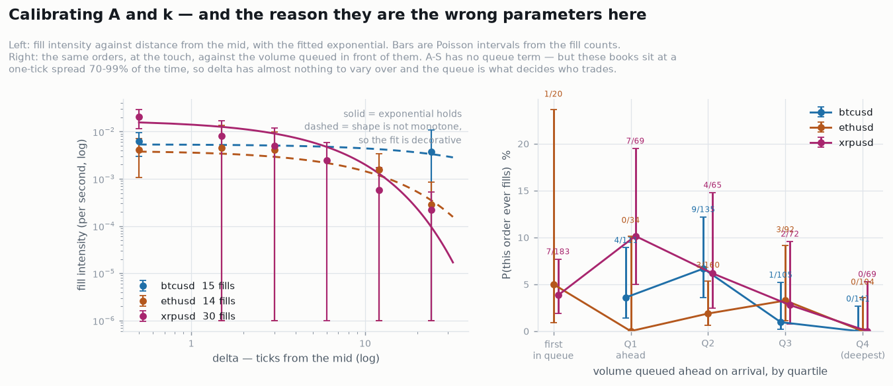

# Limit Order Book Optimizer — Maths & Applications

An industry-grade market-making limit order book optimizer: quote placement, queue
modelling, and a first-class measurement plane for time delays, distributions and
latency.

**Status: hardening — fuzzing and property tests.** The design documents are in
`docs/`; the code is the measurement plane (Phase 0), the market-by-order book it
measures (Phase 1) together with the Bitstamp L3 decoder that feeds it real data, the
feature engine that reads the book (Phase 2a), and the matching engine,
latency model and simulator loop (Phase 3), and the baseline strategies with their
P&L attribution (Phase 4). See [`docs/05-roadmap.md`](docs/05-roadmap.md).

## Build and run

```bash
cmake --preset release && cmake --build build/release
ctest --preset release            # 5 suites, ~90 assertions

./build/release/latency_demo         # per-stage attribution + HDR percentile curve
./build/release/jitter_probe 10      # this machine's jitter floor
./build/release/bench_measure        # cost of each measurement primitive
./build/release/replay 1000000 --verify   # stream events through the book, check invariants
./build/release/bench_book           # cost of each book operation
./build/release/sim_demo            # what latency costs a market maker
./build/release/backtest            # compare the five baseline strategies
./build/release/fuzz_book -runs=200000      # fuzz the book's event path
./build/release/fuzz_matching -runs=200000  # fuzz the matching engine
./tools/jitter_baseline.sh 10        # full machine baseline, for docs/BASELINE.md
```

Presets: `release`, `debug`, `asan` (ASan+UBSan), `tsan`. Tests pass under all four,
on GCC 13 and Clang 18.

## What Phase 0 built

| Component | Header | What it is for |
|---|---|---|
| Fixed-point price/qty types | `lob/core/types.hpp` | Prices are integer ticks. Never floating point — a price that depends on rounding mode makes the backtest irreproducible. |
| Arena + object pool | `lob/core/arena.hpp` | Allocate once at startup; the hot path bumps a pointer or pops a free list. Exhaustion returns `nullptr` rather than silently falling back to the heap. |
| TSC clock | `lob/measure/tsc.hpp` | ~17 ns per read versus ~25 ns for `clock_gettime`. Calibrated against `CLOCK_MONOTONIC_RAW` at startup, and refuses to claim trustworthiness without `constant_tsc` + `nonstop_tsc`. |
| HDR histogram | `lob/measure/histogram.hpp` | Full latency distributions at constant relative precision in fixed memory, ~3.7 ns per record. Includes coordinated-omission correction. No third-party dependency. |
| Per-stage recorder | `lob/measure/recorder.hpp` | One histogram per pipeline stage, so a tick-to-trade figure can be attributed rather than merely observed. |
| Append-only journal | `lob/measure/journal.hpp` | Every decision written with its sequence number and timestamps. Replay must reproduce it byte for byte — that property is what makes a backtest measure the system you actually run. |

## What Phase 1 built

| Component | Header | What it is for |
|---|---|---|
| L3 order book | `lob/book/order_book.hpp` | Market-by-order. Flat price-level array indexed by tick offset, occupancy bitset scanned with `countr_zero`/`countl_zero`, intrusive FIFO per level, open-addressed order-id map. |
| Reference book | `lob/book/reference_book.hpp` | Deliberately naive `std::map` + `std::list`. Its only job is to be a second opinion in the differential test. |
| Order map | `lob/book/order_map.hpp` | Open addressing with backward-shift deletion, so a day of balanced adds and cancels does not accumulate tombstones. |
| Synthetic flow | `lob/sim/flow.hpp` | Zero-intelligence generator. Drives the book hard enough to prove it correct; becomes the Phase 3 simulator's interface once a calibrated model sits behind it. |

## Real data

Free, genuine L3 — order-by-order over the whole book, no account and no API key.
Bitstamp is the source; see [`docs/02`](docs/02-data-and-protocols.md) §3 for why the
obvious alternatives were ruled out and §3.1 for what the feed carries.

```bash
py tools/record_bitstamp.py --pair btcusd --minutes 10     # writes to data/ (gitignored)
./build/replay --bitstamp data/btcusd_*_bitstamp.jsonl.gz --verify
```

| Component | Header | What it is for |
|---|---|---|
| JSON scanner | `lob/feed/json.hpp` | Non-allocating, total on untrusted input, exact decimal parsing. Prices never pass through `double`; a value with more precision than the tick size can hold is rejected rather than rounded. |
| Bitstamp decoder | `lob/feed/bitstamp.hpp` | The only file that knows Bitstamp exists. Recovers the cancel-vs-fill split exactly from `amount_traded`, detects capture gaps from the `event_id` chain, and checks the feed's own consistency identity on every message. |
| Line reader | `lob/feed/line_reader.hpp` | Plain, gzipped or stdin. A truncated final line — what an interrupted recording leaves — is a counted decode failure, not a read error. |

`replay --bitstamp` reports capture quality *before* anything derived from the data:
whether the sequence chain is unbroken, whether any event removed more size than its
order held, and what fraction of orders fell outside the book's price band. A number
computed over a capture with holes in it is not a measurement.

Three 10-minute Bitstamp sessions are committed in `data/samples/` and replayed by
`ctest -R capture` on every build. They are there because the day real data first ran
through this pipeline it found four defects that synthetic flow could never have
reached — `amount_traded` read as cumulative when it is per-event, marketable orders
rested when the exchange publishes them before matching, a REST snapshot trusted to
seed the book when it carries orders that never clear, and quoting precision assumed
rather than measured. See [`docs/02`](docs/02-data-and-protocols.md) §3.1–3.2.

| Pair | Spread at 1 tick | Removals that were fills | Median order life | Marketable held back |
|---|---|---|---|---|
| btcusd | 99% of the time | 0.97% | 249 ms | 10.9% |
| ethusd | 92% | 0.34% | 425 ms | 1.0% |
| xrpusd | 70% | 0.95% | 722 ms | 2.5% |

## Phase 5 — the optimiser

```bash
py tools/mdp_params.py --csv csv --out policy      # the process, measured
./build/solve --pair xrpusd --out policy/xrpusd.bin # value iteration, offline
```

An MDP over `(inventory, bid quote, ask quote, imbalance)` — 4,455 states, 9 actions —
solved offline by value iteration and shipped as a byte per state. Reading it is a bounds
check and an index: **0.6 ns**, random access, measured. No solving in the hot path, ever.

Queue position is in the state and distance from the mid is not, because that is what the
data said: P(fill) runs 3–10% at the front of the touch queue and 0.00% in the deepest
quartile, while an Avellaneda–Stoikov `k` could not be identified on two of three
instruments. The resulting policy skews hard on inventory — at the position limit it pulls
the quote on the side that would add to the position and works the other at the touch.

```bash
./build/stats --synthetic 3000000 --drift 0.0003 --grid-ms 1 --label simcal --outdir simcsv
py tools/mdp_params.py --csv simcsv --out simpolicy --dt-ms 1 --only simcal
./build/solve --params simpolicy/mdp.json --pair simcal --out simpolicy/simcal.bin
./build/evaluate --table simpolicy/simcal.bin --drift 0.0003        # the acceptance test
```

`evaluate` runs every strategy through the identical driver on identical flow, on seeds
the policy was **not** calibrated on, and settles the comparison on session P&L with a
bootstrap over seeds. The verdict is in
[`docs/05-roadmap.md`](docs/05-roadmap.md#phase-5--the-optimiser): **the criterion as
written is not met, and it is degenerate on this test bed** — the best baseline takes zero
fills. Among baselines that actually trade, the policy is the best of them.

**`solve` refuses to run on a process the data could not identify**, naming the parameter.
btcusd fails on mid dynamics (the reconstructed touch teleports rather than moves) and
ethusd on the fill rate one tick behind the touch (one observed fill). Only xrpusd solves
from measurement alone. A table built on a guess is indistinguishable from a calibrated one
once it is a file on disk.

## Calibration

`apps/stats` writes the measurement plane as CSV, `tools/figures.py` draws it, and
`tools/calibrate.py` fits the Avellaneda–Stoikov fill intensity λ(δ) = A·e^(−kδ) by
per-order Poisson MLE — every resting order is an exposure and every fill an event, so
orders cancelled before filling are not missing data but exposure without an event.

The answer is that **two of the three instruments do not admit the model**:

| Pair | A (/s) | k (/tick) | k across fit cutoffs | Verdict |
|---|---|---|---|---|
| btcusd | 0.0054 ± 0.0015 | 0.020 ± 0.044 | 48 → 0.02 → −0.02 | not identified — k changes sign |
| ethusd | 0.0040 ± 0.0013 | 0.101 ± 0.038 | −0.16 → 0.27 → 0.08 | not identified — k changes sign |
| xrpusd | 0.0174 ± 0.0039 | **0.217 ± 0.039** | 0.53 → 0.22 → 0.19 | usable, 2.9× across cutoffs |

This is a finding, not a failure. A-S is a **small-tick** model: δ is the quote's distance
from the mid, and it presumes δ has room to vary. These books sit at a one-tick spread 70–99%
of the time, so δ barely varies and what actually decides whether a passive order trades is
its **queue position** — P(fill) runs 3–10% at the front of the touch queue and hits **0.00%
in the deepest quartile** on all three instruments. That is the queue-reactive regime, and it
is the same conclusion the spread distribution reached about Phase 5's architecture.



## What Phase 2a built

| Component | Header | What it is for |
|---|---|---|
| Feature engine | `lob/feat/features.hpp` | Imbalance, deep imbalance, imbalance-weighted mid, multi-level OFI, realised vol, event rate. Every one an O(1) update rule — measured flat from 5k to 500k resting orders. |

Order flow imbalance follows Cont, Kukanov & Stoikov ([arXiv:1011.6402](https://arxiv.org/abs/1011.6402));
the multi-level extension follows [arXiv:1907.06230](https://arxiv.org/abs/1907.06230).

**On the micro-price, precisely.** The engine computes the *imbalance-weighted mid*,
which is the first-order approximation to Stoikov's micro-price. The real estimator is a
fitted object — the fixed point of a transition matrix estimated from data — and it lands
in Phase 2b with the rest of the calibration. The two differ most in exactly the states a
market maker cares about, so the code names it for what it is.

## What Phase 3 built

| Component | Header | What it is for |
|---|---|---|
| Matching engine | `lob/sim/matching.hpp` | Price-time priority, front of queue first, with self-match prevention. The book *consumes* an already-matched feed; a simulator has to do the matching, and this is where the honesty of a backtest is decided. |
| Latency model | `lob/sim/latency.hpp` | Lognormal by default, empirical when given samples. Separate inbound and outbound legs — a feed hop and a gateway hop are not the same. |
| Simulator | `lob/sim/simulator.hpp` | Discrete-event loop over two books: what the exchange holds, and what the agent knows. The gap between them is the cost of being slow. |

**The agent sees a stale book.** That is the entire point of the file. Two books are kept
deliberately — `true_book` where matching happens, `view_book` lagging by the inbound
latency — because a simulator that hands the agent the real state optimises a strategy
that cannot exist.

### What latency costs, measured

Same naive agent, same flow, same seed. It quotes passively at the touch and *never asks
to cross*:

```
                passive fills   aggressive fills   late cancels
zero latency         61                 0                48
1 ms latency        559                56               928
```

Read the aggressive column. Under latency the agent's quotes are decided on a book that
has already moved, so some land crossing and **take** liquidity instead of providing it.
Being slow silently converts a market maker into a liquidity taker, and it pays the spread
every time. The strategy never asked for that, and a zero-latency backtest would never
show it.

## What Phase 4 built

| Component | Header | What it is for |
|---|---|---|
| Quoting strategies | `lob/strat/quoting.hpp` | Constant spread → Ho–Stoll inventory skew → Avellaneda–Stoikov → GLFT → GLFT + imbalance tilt. Each adds one idea to the last, so the comparison answers *does this component pay for itself?* |
| P&L attribution | `lob/strat/pnl.hpp` | Markouts at five horizons, the spread-capture / adverse-selection decomposition, and a block bootstrap over fills. |

The identity that makes the decomposition exact, for a fill of `qty` at price `P` with
mid `M0` at the fill and `M1` at horizon τ, `s = +1` for a buy:

```
spread_capture    = s · (M0 − P) · qty
adverse_selection = s · (M0 − M1) · qty
markout           = s · (M1 − P) · qty  =  spread_capture − adverse_selection
```

Those are not two estimates of one quantity — they are the two halves a fill decomposes
into, and the tests assert they sum exactly.

### The most interesting thing the run found

```
avellaneda-stoikov  0.662 ticks  (optimal total spread 1.324)
glft (flat inv)     0.076 ticks
tick floor          1 tick
```

**The A–S optimum is below one tick.** The grid clamps it to exactly the quote the naive
rule produces, so those two rows of the results table are identical by construction. That
is not a parameter accident: on a large-tick instrument the optimal spread is routinely
sub-tick, the price optimiser has nothing left to say, and **queue position becomes the
entire game** — which is [Dayri & Rosenbaum's](https://arxiv.org/abs/1207.6325) point,
arrived at from the other direction.

### And what it cannot show

Every bootstrap in the current run reports **UNUSABLE** — 2–3 blocks, from 70–110 fills
across 400k events. That is the harness working correctly: a bootstrap over three blocks
resamples nearly the same data every draw, and the interval it produces is not a
confidence interval. The tool says so rather than printing a number that would be read as
one.

Beyond sample size, three things make any profitability reading meaningless today, each
sufficient on its own:

1. **`A` and `k` are uncalibrated.** A–S and GLFT are the optimal response to a fill
   intensity `λ(δ) = A·e^{−kδ}`. Both parameters are hand-set. Optimal quotes against the
   wrong intensity are not optimal quotes.
2. **The flow is zero-intelligence** and does not produce an exponential fill curve, so
   part of what a comparison measures is whether the generator happens to match the
   models' assumptions. It does not.
3. **No adverse selection in the flow.** The synthetic aggressors are uninformed, so the
   single largest cost a real market maker faces is absent by construction.

## Hardening

**Fuzzing.** `fuzz/` holds two targets against the standard `LLVMFuzzerTestOneInput`
signature. They build coverage-guided under libFuzzer where its runtime exists, and
against a portable driver everywhere else — blind brute force is a poor substitute for
coverage feedback, but a far better one than a target that never runs because a CI image
lacked a package.

The contract being tested is that the book survives **any** input, not plausible input.
A real feed delivers truncated packets, sequence gaps, references to orders you never saw,
and sizes that do not fit. None may crash, corrupt state, or violate an invariant; every
one must come back as a returned error.

**It found a real defect within seconds.** `add()` accepted an order that crossed the
book, while `check_invariants()` asserted the book was never crossed — the invariant
claimed something the implementation did not maintain. A crossing add cannot occur in a
real MBO feed, because the exchange matches such an order rather than booking it, so
seeing one means a sequence gap. It is now rejected with `BookError::CrossedBook` and
counted, which makes the invariant true by construction instead of by hope. 600k fuzz
cases across both targets since, clean.

**Property tests.** `tests/test_properties.cpp` asserts statements the rest of the system
silently relies on, over generated streams rather than hand-picked cases:

- quantity is conserved — everything entering the book leaves it or is still resting
- matching conserves quantity, never fills through the limit, and sweeps best price first
- imbalance stays in `[-1, 1]`; the weighted mid stays inside the spread
- percentiles are monotone in `p` and bracket the true extremes
- a rejected operation leaves the book byte-identical
- `clear()` then replay equals a fresh replay

`tests/test_order_map.cpp` differentially tests the open-addressed map against
`std::unordered_map` over 400k random operations. Backward-shift deletion is the subtlest
code here: when a slot is freed, anything that probed past it must be walked back or it
becomes unreachable — a silent failure where an order vanishes from the index while still
sitting in a level's FIFO. It also constructs deliberately colliding keys and erases from
the head and middle of a probe chain.

**Own orders live in the same FIFO as everyone else's.** That is the decision the project
turns on: queue position falls out of the structure rather than needing a parallel
bookkeeping system to be kept in sync. `queue_ahead()` is O(1) — maintained as the queue
drains, not recomputed.

Measured on this machine (see [`docs/BASELINE.md`](docs/BASELINE.md) for the full record
and its caveats):

```
measurement                          book
tsc::now (rdtsc)     16.72 ns   35.1 cy   add (deep book)        29.66 ns   62.3 cy
tsc::now_serialized  28.03 ns   58.9 cy   cancel (mid-queue)     45.09 ns   94.7 cy
Histogram::record     3.65 ns    7.7 cy   execute (partial)      21.96 ns   46.1 cy
Arena::allocate(64)   1.14 ns    2.4 cy   best_bid + best_ask     0.65 ns    1.4 cy
Pool acquire+release  0.72 ns    1.5 cy   depth(10) both sides   47.04 ns   98.8 cy
```

```
feature update @5k orders     52.75 ns    110.8 cy
feature update @50k orders    52.26 ns    109.8 cy
feature update @500k orders   53.16 ns    111.6 cy
```

Mixed synthetic stream: **5.9 M events/s**, p50 36 ns per event. Top-of-book at 1.4 cycles
is the cached-touch design paying off — the feature engine reads it on every event. And a
feature update that stays flat across a 100× change in book size is the O(1) claim
holding: if any update rule were walking the book, that row would climb.

> ### Scope: this is a model, not a trading operation
>
> The goal is a working, measurable simulation of market making — order book, queue
> dynamics, fill modelling, quote optimisation. **No live trading, no real capital, no
> paid data, no paid infrastructure.** Every phase below can be completed with free data
> and a normal machine.
>
> Where the literature or the engineering assumes a funded desk — colocation, kernel-bypass
> NICs, exchange entitlements, real fills — those are recorded as context for what the
> models are describing, and explicitly marked as out of scope. The final phase is
> **shadow mode only**: the strategy runs against a live public feed and logs what it
> *would* have done. Nothing connects to an order entry endpoint.

---

## The documents

| Doc | Contents |
|---|---|
| [`docs/00-scope-and-architecture.md`](docs/00-scope-and-architecture.md) | The three-layer split (calibration / policy solve / execution), **the language decision and why**, system architecture, threading and memory model, determinism, large-tick vs small-tick regimes, proposed repo layout |
| [`docs/01-literature.md`](docs/01-literature.md) | Annotated bibliography — ~90 papers and books, grouped by the role each plays in the system, with a suggested reading order |
| [`docs/02-data-and-protocols.md`](docs/02-data-and-protocols.md) | Why L3/MBO is a hard requirement, ITCH / MDP 3.0 / SBE / OUCH / iLink, where to get data, PCAP and the timestamp hierarchy, storage, reference data |
| [`docs/03-metrics-and-estimators.md`](docs/03-metrics-and-estimators.md) | **The measurement specification.** Clocks, latency taxonomy, how to measure latency without fooling yourself, the market's delay distributions, queue metrics, markouts, distribution fitting and goodness-of-fit, P&L attribution, statistical validity |
| [`docs/04-toolchain.md`](docs/04-toolchain.md) | C++ libraries, kernel bypass ladder, OS tuning, timing infrastructure, profiling, Python research stack, open-source prior art worth reading |
| [`docs/05-roadmap.md`](docs/05-roadmap.md) | Seven phases, each with explicit "done when" criteria |
| [`docs/BASELINE.md`](docs/BASELINE.md) | This machine's measured jitter floor and primitive costs — the numbers every later claim is relative to |

## The short version

**Language.** C++20/23 for the execution layer — feed handler, order book, feature engine,
policy evaluation, order gateway, *and the simulator core*. Python for calibration, policy
solving and analysis. The C++ book and feature engine are exposed to Python via nanobind
so research and production compute the same numbers from the same code. Rust is a
defensible alternative for the hot path; C++ wins on vendor SDKs (`ef_vi`, DPDK, exchange
SBE codecs) and on the fact that all the reference material is C++.

**The key architectural decision.** The execution layer never solves an optimisation
problem. The HJB/MDP solution is computed offline and shipped as a lookup table; online,
quoting is an array index plus guards. Nanoseconds, deterministic, interrogable.

**What makes it "industry level"** rather than a weekend order book:

- queue-position-aware fills (a backtest that fills you whenever price touches your limit
  overstates P&L by a large factor),
- a latency model inside the simulator, in both directions,
- per-fill adverse-selection accounting via markouts at multiple horizons,
- bit-for-bit determinism between live and replay,
- distributions and goodness-of-fit tests, not point estimates,
- risk controls on the critical path, not in a monitoring script.

**Two regimes, two code paths.** Large-tick instruments (spread pinned at one tick, deep
queues) are a queue-position game. Small-tick instruments are a price-placement game. They
need different state variables and different optimisers. Start large-tick.

## Where to start reading

1. [`docs/00-scope-and-architecture.md`](docs/00-scope-and-architecture.md) §1 — the language question, answered.
2. [`docs/03-metrics-and-estimators.md`](docs/03-metrics-and-estimators.md) — what "measure everything" actually means.
3. [`docs/01-literature.md`](docs/01-literature.md) §O — the reading order.

---

## License

See [`All Rights Reserved`](./All%20Rights%20Reserved). Copyright (c) 2026 Harjot Singh.
